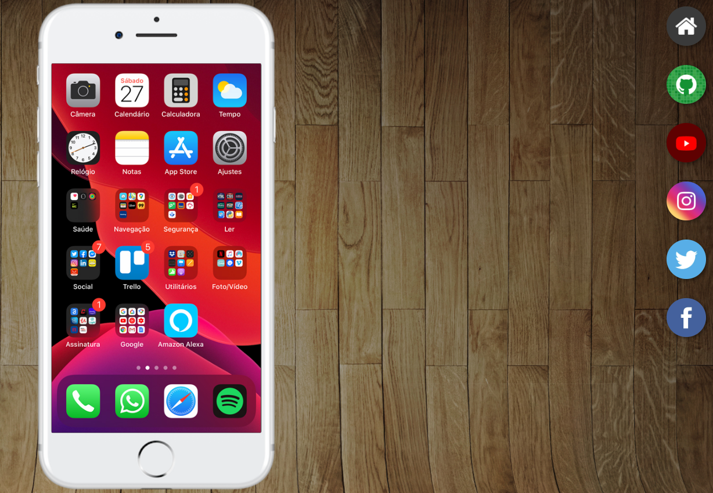

# projeto-social
Projeto de Redes Sociais

## 🖥️ Projeto

Projeto Redes Sociais. Projeto trabalhado com frames. Ao clicar num ícone no canto direito, criamos um frame dentro do celular para apresentar a imagem da rede social como se estivesse na própria rede social.

## 🚀 Tecnologias

Esse projeto foi desenvolvido com as seguintes tecnologias:

- HTML
- CSS
- Git e Github
